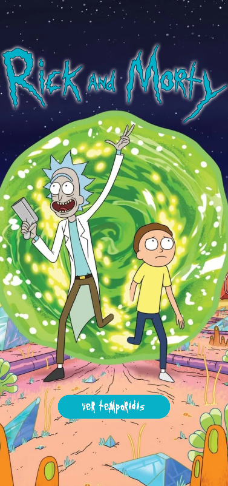
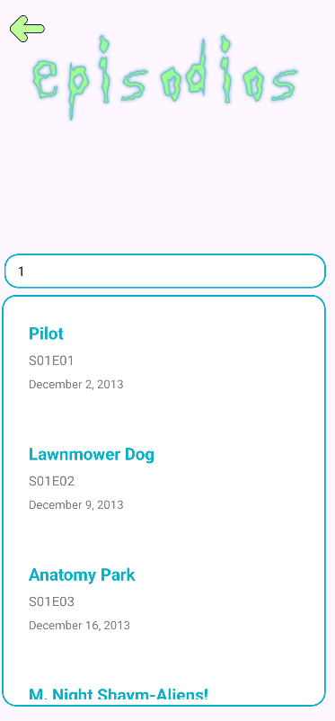
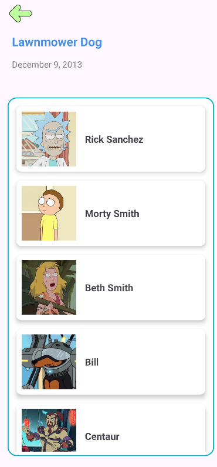

# 📱 Rick & Morty App

Aplicación Android que consume la API pública de [Rick and Morty](https://rickandmortyapi.com/) para mostrar episodios, personajes y temporadas de la serie.  
Desarrollada en **Kotlin** usando arquitectura **MVVM**, **RecyclerView** y consumo de **API REST**.

<p align="center">
  
</p>

---

## 🚀 Funcionalidades

- ✅ Pantalla principal con botón para ver temporadas
- ✅ Spinner para seleccionar temporada
- ✅ Lista de episodios por temporada (RecyclerView)
- ✅ Pantalla con detalles del episodio
- ✅ Lista de personajes del episodio (RecyclerView)
- ✅ Navegación entre pantallas
- ✅ Arquitectura MVVM
- ✅ Llamadas a la API REST con Retrofit

---

## 🧱 Tecnologías usadas

- **Kotlin**
- **Android Studio**
- **MVVM Architecture**
- **RecyclerView**
- **Retrofit** (para llamadas HTTP)
- **Gson** (para parsear JSON)
- **Glide** (para cargar imágenes de personajes)
- **ViewModel y LiveData**
- **SharedPreferences** (para preferencias de usuario)

---

## 🖼️ Capturas de pantalla

> *(Falta por añadir las fotos)*

<p align="center">
  
  
  
</p>

---

## 🔧 Cómo ejecutar el proyecto

1. Clona este repositorio:
   ```bash
   git clone https://github.com/marp0604/APIRickYMorty.git
2. Abre el proyecto en Android Studio.
3. Asegúrate de tener configurado un emulador o dispositivo físico.
4. Ejecuta la app desde el botón ▶️.

---

## 🧠 Aprendizajes del proyecto

- Aplicación real del patrón **MVVM** en Android.
- Manejo de **Retrofit** para el consumo de servicios REST.
- Comunicación entre **ViewModel**, **LiveData** y **RecyclerView**.
- Manejo de **navegación** y múltiples pantallas.
- Consumo de una API externa real y visualización dinámica.

---

## 📌 Futuras mejoras

- [ ] Añadir búsqueda de personajes
- [ ] Guardar favoritos con Room
- [ ] Modo oscuro
- [ ] Paginación de listas
- [ ] Mejoras visuales en UI

---

## 👨‍💻 Autor

**Miguel Ángel Ramírez Pérez**  
Estudiante de Desarrollo de Aplicaciones Multiplataforma

---

## 📝 Licencia

Este proyecto es de uso educativo y sin fines comerciales.  
La API utilizada es pública y ofrecida por [https://rickandmortyapi.com/](https://rickandmortyapi.com/)

---

<p align="center">💬 ¡Gracias por visitar este proyecto! Si te gusta, deja una ⭐</p>
