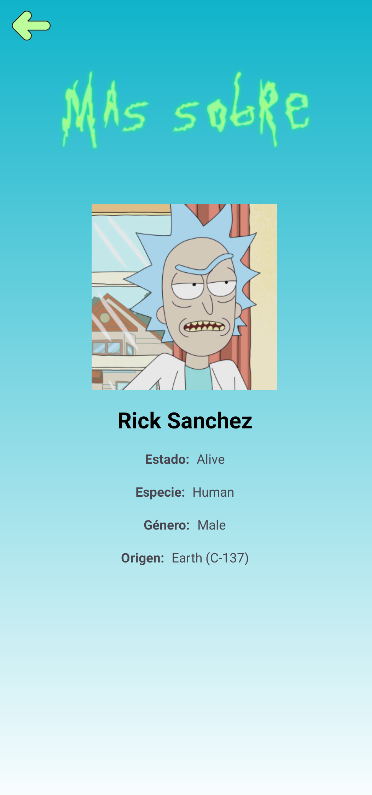

<div align="center">

# 🛸 Rick & Morty Android App

[](https://kotlinlang.org/)
[](https://www.android.com/)
[](https://android-arsenal.com/api?level=24)
[](LICENSE)

Una aplicación Android nativa desarrollada en **Kotlin** que consume la [Rick and Morty API](https://rickandmortyapi.com/) para mostrar información completa sobre episodios, personajes y temporadas de la serie. 


[Características](#-características-principales) • [Arquitectura](#-arquitectura) • [Tecnologías](#-stack-tecnológico) • [Instalación](#-instalación) • [Uso](#-uso)

</div>

---

## 📱 Características Principales

✨ **Exploración de Temporadas**
- Selector de temporadas mediante Spinner interactivo
- Visualización de todos los episodios por temporada
- Navegación fluida entre pantallas

🎬 **Detalles de Episodios**
- Información detallada de cada episodio
- Fecha de emisión
- Lista completa de personajes que aparecen

👥 **Catálogo de Personajes**
- Fichas detalladas de personajes
- Imágenes de alta calidad cargadas dinámicamente
- Información completa: estado, especie, género y origen
- Navegación desde episodio a personaje

🎨 **Experiencia de Usuario**
- Interfaz moderna con Material Design
- Diseño Edge-to-Edge
- RecyclerView con scroll optimizado
- Carga asíncrona de datos sin bloqueo de UI

---

## 🏗️ Arquitectura

Este proyecto implementa el patrón **MVVM (Model-View-ViewModel)** junto con buenas prácticas de desarrollo Android:

```
app/
├── data/               # Capa de datos
│   └── EpisodioService # Interface Retrofit para API
├── model/              # Modelos de datos
│   ├── Episodio
│   ├── Personaje
│   ├── Info
│   └── ... 
├── view/               # Capa de presentación
│   ├── MainActivity
│   ├── SelectEpisodiosActivity
│   ├── EpisodioDetalleActivity
│   ├── PersonajeDetalleActivity
│   └── adapters/
│       ├── EpisodioAdapter
│       └── PersonajeAdapter
└── viewmodel/          # Lógica de negocio (si aplica)
```

### Principios Aplicados
- **Separación de responsabilidades**: Cada capa tiene un propósito específico
- **Inyección de dependencias**: Uso de Retrofit para consumo de API
- **Programación reactiva**: Coroutines para operaciones asíncronas
- **View Binding**: Acceso type-safe a las vistas

---

## 🛠️ Stack Tecnológico

### Lenguaje y Framework
- **[Kotlin](https://kotlinlang.org/)** - Lenguaje principal (100%)
- **Android SDK** - API Level 24+ (Android 7.0+)
- **Target SDK**: 35

### Bibliotecas Principales

| Categoría | Biblioteca | Versión | Propósito |
|-----------|-----------|---------|-----------|
| **Networking** | [Retrofit](https://square.github.io/retrofit/) | Latest | Cliente HTTP para consumo de API REST |
| **Serialización** | [Gson](https://github.com/google/gson) | Latest | Conversión JSON ↔ Objetos Kotlin |
| **Imágenes** | [Picasso](https://square.github. io/picasso/) | Latest | Carga y caché de imágenes |
| **Asincronía** | [Kotlin Coroutines](https://kotlinlang.org/docs/coroutines-overview.html) | Latest | Manejo de operaciones asíncronas |
| **UI** | [Material Components](https://material.io/develop/android) | Latest | Componentes de diseño Material |
| **View Binding** | ViewBinding | Built-in | Binding type-safe de vistas |

### Arquitectura y Patrones
- **MVVM** (Model-View-ViewModel)
- **Repository Pattern** (implícito en services)
- **RecyclerView** con ViewHolder pattern
- **Coroutines** para threading

---

## 🚀 Instalación

### Prerrequisitos
- **Android Studio** Hedgehog | 2023.1.1 o superior
- **JDK** 11 o superior
- **Android SDK** con API Level 24+
- **Gradle** 8.x (incluido en el proyecto)

### Pasos de Instalación

1. **Clona el repositorio**
```bash
git clone https://github. com/marp0604/APIRickYMorty.git
cd APIRickYMorty
```

2. **Abre el proyecto en Android Studio**
```bash
# Desde terminal
studio . 

# O desde Android Studio: File > Open > Selecciona la carpeta del proyecto
```

3. **Sincroniza las dependencias**
   - Android Studio sincronizará automáticamente Gradle
   - Si no lo hace: `File > Sync Project with Gradle Files`

4. **Configura un emulador o dispositivo físico**
   - **Emulador**: Tools > Device Manager > Create Device
   - **Dispositivo físico**: Habilita las opciones de desarrollador y depuración USB

5. **Ejecuta la aplicación**
```bash
# Desde Android Studio
Run > Run 'app'

# O presiona Shift + F10
```

---

## 📖 Uso

### Flujo de Navegación

```
MainActivity (Pantalla de inicio)
    ↓
    [Ver Temporadas]
    ↓
SelectEpisodiosActivity (Selector de temporada + Lista de episodios)
    ↓
    [Click en episodio]
    ↓
EpisodioDetalleActivity (Detalles + Lista de personajes)
    ↓
    [Click en personaje]
    ↓
PersonajeDetalleActivity (Información completa del personaje)
```

### Funcionalidades Principales

1. **Explorar Temporadas**
   - Desde la pantalla principal, pulsa "Ver Temporadas"
   - Selecciona una temporada del Spinner (S01-S05)
   - Visualiza todos los episodios de esa temporada

2. **Ver Detalles de Episodio**
   - Toca cualquier episodio de la lista
   - Consulta fecha de emisión y personajes

3. **Conocer Personajes**
   - Desde un episodio, toca cualquier personaje
   - Visualiza imagen, estado (vivo/muerto), especie, género y origen

---

## 🎯 API Utilizada

Esta aplicación consume la **Rick and Morty API** pública:

- **Base URL**: `https://rickandmortyapi. com/api/`
- **Endpoints utilizados**:
  - `GET /episode` - Lista de episodios
  - `GET /episode/{id}` - Detalle de episodio
  - `GET /character/{id}` - Detalle de personaje
- **Documentación**: [rickandmortyapi.com/documentation](https://rickandmortyapi.com/documentation)

### Ejemplo de Request

```kotlin
interface EpisodioService {
    @GET("episode")
    suspend fun getAllEpisodes(): EpisodioResponse
    
    @GET("episode/{id}")
    suspend fun getEpisodeById(@Path("id") id: Int): Episodio
    
    @GET("character/{id}")
    suspend fun getCharacterById(@Path("id") id: Int): Personaje
}
```

---

## 📸 Capturas de Pantalla

> _Próximamente: Capturas de la aplicación en funcionamiento_

<div align="center">

| Pantalla Principal | Lista de Episodios | Detalle de Episodio | Detalle de Personaje |
|:------------------:|:------------------:|:-------------------:|:--------------------:|
|  |  |  |  |

</div>

---

## 🧪 Testing

El proyecto incluye configuración para:

- **Unit Tests**: `app/src/test/` - Tests locales con JUnit
- **Instrumentation Tests**: `app/src/androidTest/` - Tests en dispositivo/emulador

```bash
# Ejecutar tests unitarios
./gradlew test

# Ejecutar tests instrumentados
./gradlew connectedAndroidTest
```

---

## 📚 Aprendizajes del Proyecto

Durante el desarrollo de esta aplicación se implementaron:

✅ **Consumo de APIs REST** con Retrofit y Gson  
✅ **Programación asíncrona** con Kotlin Coroutines  
✅ **Arquitectura MVVM** para separación de capas  
✅ **RecyclerView** con adaptadores personalizados  
✅ **View Binding** para acceso seguro a vistas  
✅ **Navegación entre Activities** con Intents  
✅ **Carga dinámica de imágenes** con Picasso  
✅ **Manejo de estados** (loading, success, error)  
✅ **Material Design Components**  
✅ **Edge-to-Edge UI** con WindowInsets

---

## 🔮 Roadmap y Mejoras Futuras

- [ ] 🔍 Implementar búsqueda de personajes y episodios
- [ ] ⭐ Sistema de favoritos con Room Database
- [ ] 🌙 Modo oscuro (Dark Theme)
- [ ] 📄 Paginación en listas largas
- [ ] 🎨 Animaciones de transición entre pantallas
- [ ] 🔔 Sistema de notificaciones para nuevos episodios
- [ ] 🌐 Soporte multiidioma (ES/EN)
- [ ] 📊 Estadísticas y gráficos de personajes
- [ ] 🧪 Cobertura de tests al 80%
- [ ] 🏗️ Migración a Jetpack Compose

---

## 🤝 Contribuciones

Este es un proyecto educativo, pero las contribuciones son bienvenidas:

1. Fork el proyecto
2. Crea una rama para tu feature (`git checkout -b feature/AmazingFeature`)
3.  Commit tus cambios (`git commit -m 'Add some AmazingFeature'`)
4. Push a la rama (`git push origin feature/AmazingFeature`)
5. Abre un Pull Request

---

## 👨‍💻 Autor

**Miguel Ángel Ramírez Pérez**  
_Estudiante de Desarrollo de Aplicaciones Multiplataforma_

[](https://github.com/marp0604)

---

## 📄 Licencia

Este proyecto tiene fines **exclusivamente educativos** y no comerciales.

- La **Rick and Morty API** es pública y gratuita
- Los derechos de la serie Rick and Morty pertenecen a sus respectivos propietarios
- El código fuente de esta aplicación está disponible para aprendizaje


---

<div align="center">

### ⭐ Si este proyecto te ha sido útil, considera darle una estrella

**Hecho con ❤️ y Kotlin**

[⬆ Volver arriba](#-rick--morty-android-app)

</div>
